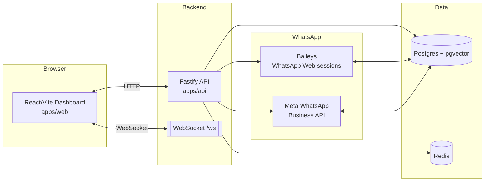

# Typo - WhatsApp AI Sales Agent (Baileys + RAG)

A SaaS-ready foundation for a QR-based WhatsApp AI sales assistant with:

- Multi-session WhatsApp Web connections via Baileys
- JWT-auth web onboarding + dashboard
- RAG knowledge ingestion (website, PDF, manual FAQ)
- PostgreSQL + `pgvector` retrieval
- Lead scoring, manual takeover, AI pause, and anti-ban safety delays
- Realtime websocket updates for QR, session status, and conversation events

## Monorepo Structure

- `apps/api`: Fastify + Baileys backend
- `apps/web`: React + Vite frontend
- `infra/schema.sql`: baseline PostgreSQL schema
- `infra/migrations`: versioned incremental migrations
- `infra/docker-compose.yml`: Postgres (`pgvector`) + Redis

## Prerequisites

- Node.js 20+
- Docker (recommended for local DB)

## Quick Start

1. Start infrastructure:
   ```bash
   docker compose -f infra/docker-compose.yml up -d
   ```
2. Install dependencies:
   ```bash
   npm install
   ```
3. Configure environment files:
   - Copy `apps/api/.env.example` to `apps/api/.env`
   - Copy `apps/web/.env.example` to `apps/web/.env`
4. Run migrations:
   ```bash
   npm run db:migrate
   ```
5. Start app:
   ```bash
   npm run dev
   ```
6. Open `http://localhost:8080`

## Production-safe DB Migrations

Use these commands during deploys so schema changes are explicit and tracked, without runtime auto-DDL in app startup.

```bash
npm run db:migrate
npm run db:migrate:status
```

Recommended deploy order:

1. Build new API image/release.
2. Run `npm run db:migrate` against production DB.
3. Start/roll out new API version.

Local cleanup (dev only):

```bash
ALLOW_DB_RESET=true npm run db:reset:dev -- --force
```

`db:reset:dev` is blocked in `NODE_ENV=production` and requires explicit `ALLOW_DB_RESET=true` + `--force`.

## Docker Full Stack

Run everything (`api`, `web`, `postgres`, `redis`) in containers:

```bash
npm run dev:full
```

- Web: `http://localhost:8080`
- API: `http://localhost:4000`

`dev:full` now runs in `--watch` mode by default (auto rebuild on file changes).
Run once without watch:

```bash
npm run dev:full:once
```

Manual rebuild only `web` container (forced no-cache, if UI updates are not reflecting):

```bash
npm run dev:full:rebuild:web
```

After rebuild, hard refresh the browser on `http://localhost:8080/dashboard` (`Ctrl+Shift+R`).

Stop:

```bash
npm run dev:full:down
```

## Production Reverse Proxy (Required for Websocket)

If you put another Nginx in front of the `web` container (for TLS/domain routing), it must forward websocket upgrade headers.
Use [`infra/nginx/host-default.conf`](infra/nginx/host-default.conf) as the base host config.

Quick validation from any machine that can reach production:

```bash
curl --http1.1 -i \
  -H "Connection: Upgrade" \
  -H "Upgrade: websocket" \
  -H "Sec-WebSocket-Version: 13" \
  -H "Sec-WebSocket-Key: dGhlIHNhbXBsZSBub25jZQ==" \
  "https://wagenai.com/ws?token=<jwt>"
```

Expected response starts with `HTTP/1.1 101 Switching Protocols`.

## Backend Flow

1. User signs up.
2. User triggers WhatsApp connect -> Baileys starts auth handshake.
3. QR events stream over websocket (`/ws`).
4. Session auth state is persisted in DB (`whatsapp_sessions.session_auth_json`).
5. Incoming WhatsApp messages:
   - Inbound only filter
   - Conversation + lead score updates
   - Cooldown + random delay rules
   - RAG retrieval + LLM response
   - Reply through same Baileys session

## API Highlights

- `POST /api/auth/signup`
- `POST /api/auth/login`
- `GET /api/auth/me`
- `POST /api/whatsapp/connect`
- `GET /api/whatsapp/status`
- `POST /api/onboarding/business`
- `POST /api/knowledge/ingest/website`
- `POST /api/knowledge/ingest/pdf`
- `POST /api/knowledge/ingest/manual`
- `POST /api/onboarding/personality`
- `POST /api/onboarding/activate`
- `GET /api/dashboard/overview`
- `GET /api/conversations`
- `GET /api/conversations/:conversationId/messages`
- `PATCH /api/conversations/:conversationId/manual-takeover`
- `PATCH /api/conversations/:conversationId/pause`

## Safety Rules Implemented

- Random reply delay (`REPLY_DELAY_MIN_MS`, `REPLY_DELAY_MAX_MS`)
- Replies only to inbound direct messages
- Contact cooldown (`CONTACT_COOLDOWN_SECONDS`)
- Manual takeover and AI pause at conversation level

## Notes

- OpenAI key is required for embeddings + full LLM responses.
- Without OpenAI key, fallback responses work but knowledge retrieval is disabled.
- Redis is provisioned but optional in this base implementation.

## Tech Stack Overview

- **Backend (`apps/api`)**:
  - **Runtime**: Node.js 20+, TypeScript
  - **Framework**: `fastify@5` with `@fastify/jwt`, `@fastify/websocket`, `@fastify/multipart`
  - **WhatsApp Web**: `@whiskeysockets/baileys`
  - **RAG & AI**: `openai` (embeddings + chat), `cheerio` (HTML scraping), `pdf-parse` (PDF ingestion)
  - **Data layer**: `pg` (PostgreSQL), `pgvector` extension, Redis (`ioredis`)
  - **Billing**: `razorpay` SDK
  - **Auth**: Local email/password with bcrypt, JWT sessions, and native Google OAuth

- **Dashboard Web App (`apps/web`)**:
  - **Runtime**: React 18 + Vite
  - **Routing**: `react-router-dom`
  - **Realtime**: Browser WebSocket client to `/ws?token=<jwt>`
  - **Misc**: `qrcode` for QR rendering

- **Marketing / Landing Site (`apps/landing`)**:
  - **Runtime**: Next.js App Router (port 8080 inside container)
  - **UI**: Tailwind / Radix-based component system (shadcn-style)
  - Primarily for marketing, docs, and signup funnel – not required for core API usage.

- **Infrastructure (`infra`)**:
  - **PostgreSQL 16 + pgvector** (`pgvector/pgvector:pg16`)
  - **Redis 7** (optional but provisioned)
  - **Docker compose**:
    - `infra/docker-compose.yml` – local DB-only stack
    - `infra/docker-compose.full.yml` – `api + web + landing + postgres + redis`
  - **Reverse proxy**: Nginx host config in `infra/nginx/host-default.conf`

## High-Level Architecture

At a high level, the system looks like this:



- **Browser dashboard** talks to the **Fastify API** over REST and subscribes to **WebSocket** events for QR code, connection status, and conversation updates.
- The **API** manages:
  - User auth and onboarding
  - Baileys multi-session WhatsApp Web connections
  - Official Meta WhatsApp Business API connections
  - RAG pipeline (knowledge ingestion + retrieval)
  - Billing and subscription state
- **Postgres + pgvector** is the source of truth for users, WhatsApp sessions, conversations, AI review queue, billing, and knowledge chunks.
- **Redis** is used for ephemeral / caching concerns (optional in base implementation).

## Apps Overview

- **`apps/api`** – core backend:
  - `src/app.ts` builds the Fastify app, wiring core plugins and routes:
    - Auth, onboarding, knowledge ingestion, WhatsApp connection, dashboard, billing, Meta, agents, conversations, SDK, AI review.
    - Realtime websocket hub (`/ws`) and widget chat gateway (`/widget/ws`).
  - **Realtime**:
    - `/ws?token=<jwt>` channel streams:
      - `whatsapp.qr`, `whatsapp.status`
      - `conversation.updated`
      - `agent.status`
  - **WhatsApp connectivity**:
    - Baileys-based multi-session manager, one session per `user_id`, persisted in `whatsapp_sessions.session_auth_json`.
    - Meta Business API integration with encrypted tokens in `whatsapp_business_connections.access_token_encrypted`.

- **`apps/web`** – SaaS dashboard:
  - Entry `src/App.tsx` defines all routes:
    - `/signup` – email signup + password
    - `/onboarding` – business basics + knowledge + agent personality
    - `/onboarding/qr` – WhatsApp QR connect
    - `/dashboard` – overview, conversations, settings, AI review queue, billing
    - `/purchase` – checkout / Razorpay subscription
    - `/meta-callback` – Meta OAuth embedded signup callback
  - `ProtectedLayout` wraps authenticated routes, ensures:
    - User has a valid JWT
    - Onboarding is complete (business basics filled) before allowing dashboard.

- **`apps/landing`** – separate Next.js marketing app:
  - Used when running `npm run dev:full` – served behind the `web` container’s Nginx.

## Data Model Overview (PostgreSQL)

Key tables defined in `infra/schema.sql`:

- **`users`**:
  - Core SaaS account record.
  - Fields for name, email, `password_hash`, `google_auth_sub`, and `subscription_plan`.
  - `business_basics` JSON (company name, what you sell, target audience).
  - `personality`, `custom_personality_prompt`, `ai_active`.

- **`whatsapp_sessions`**:
  - One row per user for Baileys WhatsApp Web sessions.
  - `session_auth_json` contains Baileys auth state (keys, device info).
  - `status` and `phone_number` drive UI connection state.

- **`knowledge_base`**:
  - RAG chunks:
    - `source_type` (website, pdf, manual)
    - `content_chunk` text
    - `embedding_vector vector(1536)` for pgvector similarity search.

- **`conversations` / `conversation_messages`**:
  - Per-customer WhatsApp conversation threads with:
    - `lead_kind` (lead, feedback, complaint, other)
    - `stage` and lead `score`
    - `ai_paused`, `manual_takeover`
  - Messages table stores inbound / outbound message text and timestamps.

- **`lead_summaries`**:
  - LLM-generated summary per conversation, used for dashboard at-a-glance.

- **`ai_review_queue`**:
  - Low-confidence or sensitive messages pushed to a human review queue.
  - Fields for question, AI response, confidence score, trigger signals, resolution.

- **`agent_profiles`**:
  - Configurable agent per channel (`web`, `qr`, `api`), with:
    - `linked_number`, `objective_type`, `task_description`
    - Personality + custom prompt overrides.
  - Conversations can be assigned to agent profiles.

- **`whatsapp_business_connections`**:
  - Official Meta WhatsApp Business API connections.
  - Stores WABA ID, phone number ID, encrypted access token, metadata.

- **`user_subscriptions` / `subscription_payments`**:
  - Stores Razorpay entities and denormalized subscription state.

Each primary entity has `created_at` / `updated_at` and `touch_updated_at` triggers to keep `updated_at` consistent on modifications.

## Key End-to-End Flows

### 1. Signup & Onboarding

1. User visits `/signup` and creates an account.
2. Backend creates a `users` row with trial `subscription_plan` and empty `business_basics`.
3. User is redirected to `/onboarding`, where they:
   - Fill company name, what they sell, and target audience.
   - Optionally ingest knowledge (website, PDF, manual FAQ).
   - Configure tone/personality of the AI agent.
4. `business_basics`, `personality`, and knowledge chunks are persisted.
5. Once onboarding is complete, `ProtectedLayout` allows access to `/dashboard`.

### 2. WhatsApp Web QR Connect (Baileys)

1. From the dashboard, user clicks "Connect WhatsApp" (QR flow).
2. Frontend calls API (`/api/whatsapp/connect`) to start a Baileys session.
3. Backend:
   - Creates/loads session state from `whatsapp_sessions.session_auth_json`.
   - Opens Baileys connection and emits QR events to the user via `/ws`.
4. Frontend:
   - Subscribes to `/ws?token=<jwt>`.
   - Renders live QR codes as `whatsapp.qr` events arrive.
5. When the user scans the QR in the WhatsApp app, Baileys completes auth:
   - Backend updates `whatsapp_sessions.status` and `phone_number`.
   - UI receives `whatsapp.status` events and shows "Connected".

### 3. Meta WhatsApp Business API (Official)

Meta integration is documented in `docs/meta-whatsapp-business-api.md`.

High-level:

1. Operator configures Meta App and Embedded Signup (see doc for fields).
2. Dashboard’s "Connect WhatsApp Business API" flow:
   - Loads Facebook SDK.
   - Opens Embedded Signup with `config_id`.
   - Obtains auth `code` and sends to backend (`/api/meta/business/complete`).
3. Backend:
   - Exchanges `code` for long-lived token.
   - Stores encrypted token in `whatsapp_business_connections.access_token_encrypted`.
   - Persists WABA ID and phone number ID.
4. Incoming messages are delivered via `GET/POST /meta-webhook`:
   - Backend resolves `phone_number_id` to user and agent profile.
   - Routes message through the same RAG + LLM pipeline, but replies via Meta Graph API.

### 4. RAG Knowledge Ingestion & AI Replies

1. User ingests knowledge via:
   - `POST /api/knowledge/ingest/website`
   - `POST /api/knowledge/ingest/pdf`
   - `POST /api/knowledge/ingest/manual`
2. Backend:
   - Normalizes and chunks source content (~900 characters with overlap).
   - Calls OpenAI embeddings and stores vectors in `knowledge_base.embedding_vector`.
3. Incoming customer message (from Baileys or Meta):
   - Stored in `conversation_messages` and conversation state updated.
   - Safety rules applied (inbound-only, cooldowns, random reply delay, pause / takeover).
   - Last N messages + top-K knowledge chunks retrieved from Postgres using vector similarity.
   - LLM is prompted with:
     - Business basics
     - Personality + custom prompt
     - Conversation history + relevant chunks.
   - LLM response is:
     - Delayed by randomized delay window.
     - Sent back via Baileys or Meta.
     - Persisted as outbound message and broadcasted via websocket.

If confidence is low or triggers fire (e.g., specific phrases), the entry can be pushed to `ai_review_queue` for a human decision.

### 5. Billing & Plans (Razorpay)

1. User navigates to `/purchase`.
2. Frontend interacts with Razorpay checkout to create / confirm a subscription.
3. Backend updates `user_subscriptions` and `subscription_payments` tables on webhooks / success callbacks.
4. Dashboard shows:
   - Current plan (`plan_code`)
   - Status and renewal dates.
5. For Meta Business API mode, the UI emphasizes:
   - Platform fee (e.g. `Rs.249/month`)
   - Meta conversation charges billable separately by Meta.

## Environment & Configuration

- **Backend env (`apps/api/.env`)**:
  - Core:
    - `PORT`, `APP_BASE_URL`, `DATABASE_URL`, `REDIS_URL`
    - `JWT_SECRET`
  - OpenAI:
    - `OPENAI_API_KEY` (required for embeddings + LLM)
  - Meta WhatsApp:
    - `META_APP_ID`, `META_APP_SECRET`, `META_EMBEDDED_SIGNUP_CONFIG_ID`
    - `META_VERIFY_TOKEN`, `META_REDIRECT_URI`
    - `META_PHONE_REGISTRATION_PIN`, `META_GRAPH_VERSION`
    - `META_TOKEN_ENCRYPTION_KEY`

- **Web env (`apps/web/.env`)**:
  - `VITE_API_URL` pointing at the API base URL (e.g. `http://localhost:4000` or your HTTPS domain).

Refer to `.env.example` files in both `apps/api` and `apps/web` for the full list of supported variables.

## Local Development vs Production

- **Local (simple)**:
  - Run infra-only compose:
    - `docker compose -f infra/docker-compose.yml up -d`
  - Start backend:
    - `cd apps/api && npm run dev`
  - Start web dashboard:
    - `cd apps/web && npm run dev`

- **Local (full stack in Docker)**:
  - `npm run dev:full` (or `dev:full:once`) from repo root.
  - Web: `http://localhost:8080`
  - API: `http://localhost:4000`

- **Production**:
  - Build versioned Docker images for `api`, `web`, and `landing`.
  - Apply migrations via `npm run db:migrate` before switching traffic.
  - Place Nginx (or another reverse proxy) with TLS in front of the `web` container, reusing `infra/nginx/host-default.conf` as a baseline and ensuring WebSocket headers are forwarded.

With this, a new engineer should be able to:

- Understand all moving parts (API, web, landing, Postgres, Redis, WhatsApp, Meta).
- Run the stack locally.
- Reason about how lead conversations flow from inbound WhatsApp to RAG-powered AI replies, and where to hook in for customization (prompts, safety rules, billing, and agent profiles).

## Flow Module (Active Development)

The **Flow Module** is the next major feature being built — it turns the existing visual flow builder UI into a fully functional message automation engine.

### Current State

The visual flow builder UI lives at `apps/web/src/modules/dashboard/studio/flows/route.tsx` (1200+ lines). It supports:
- 21 node types across 6 categories (Triggers, Send, Ask, Utilities, Actions, AI)
- 6 trigger types (keyword, any_message, webhook, template_reply, qr_start, website_start)
- ReactFlow-based drag-and-drop canvas
- Node config panels, snapshots, test mode, analytics display

**What doesn't exist yet**: backend persistence (no DB tables, no API), execution engine, and trigger integration with the inbound message pipeline.

### What's Being Built

See **[docs/FLOW_MODULE.md](docs/FLOW_MODULE.md)** for the complete development plan, including:
- Database schema (`flows`, `flow_sessions` tables)
- Flow execution engine architecture
- API routes (`/api/flows`)
- Integration point in `message-router-service.ts`
- Node-by-node execution contract
- Frontend wiring (API persistence instead of local state)

### Node Type Reference

| Category | Node | Description |
|---|---|---|
| Triggers | `start` | Entry point with trigger config |
| Triggers | `end` | Terminal node with closing message |
| Send Message | `send_text` | Send plain text (supports `{{variables}}`) |
| Send Message | `send_media` | Send image/video/document |
| Send Message | `send_voice` | Send voice note |
| Send Message | `send_template` | Send WhatsApp approved template |
| Ask Questions | `ask_text` | Collect free-text input → variable |
| Ask Questions | `ask_number` | Collect numeric input → variable |
| Ask Questions | `ask_phone` | Collect phone number → variable |
| Ask Questions | `ask_email` | Collect email → variable |
| Ask Questions | `ask_form` | Collect multiple fields |
| Ask Questions | `ask_location` | Collect location/city |
| Ask Questions | `ask_list_option` | List picker (up to 10 options) |
| Ask Questions | `ask_button_option` | Button picker (up to 3 buttons) |
| Utilities | `wait_node` | Delay execution (seconds/minutes/hours) |
| Utilities | `condition_node` | If/else branching on variables |
| Utilities | `set_variable` | Set a conversation variable |
| Actions | `assign_agent` | Hand off to human agent queue |
| Actions | `webhook_node` | Call external HTTP endpoint |
| AI | `ai_reply` | Knowledge-base-grounded reply (premium) |
| AI | `ai_intent` | Route by detected intent (premium) |

## Roadmap

- [x] Multi-channel WhatsApp (QR + Meta Cloud API + Web Widget)
- [x] AI reply pipeline (RAG + GPT-4o-mini)
- [x] Lead scoring & stage tracking (cold → warm → hot)
- [x] CRM contacts (import/export/tagging)
- [x] Agent profiles (per-channel personality & objective)
- [x] Billing (Razorpay subscriptions + credit system)
- [x] Real-time inbox (WebSocket)
- [x] AI review queue
- [x] Flow Builder UI (ReactFlow visual editor — all 21 nodes)
- [ ] **Flow execution engine (backend)** ← active development
- [ ] Flow DB persistence + API (`/api/flows`)
- [ ] Flow analytics (started / completed / drop-off per node)
- [ ] Broadcast campaigns (push to contact lists)
- [ ] Multi-user workspaces (team collaboration)
- [ ] WhatsApp catalog integration
