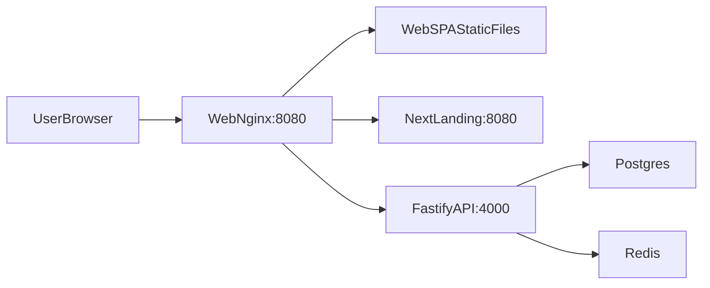

# Architecture Notes

## System Overview (High Level)

This repo is a multi-app setup:

- `apps/web`: Vite + React (SPA dashboard UI)
- `apps/landing`: Next.js (marketing + legal pages)
- `apps/api`: Fastify (REST API + websocket + SDK bundle)
- `infra/docker-compose*.yml`: Local/prod-like stack with Postgres + Redis

In the `infra/docker-compose.full.yml` setup, `apps/web` runs behind Nginx and acts as a reverse-proxy:

### Key External Endpoints (as seen by the browser)

When serving via the Nginx container (`apps/web/nginx.conf`), the browser uses a single origin:

- `/` and `/_next/*`: proxied to the Next.js landing app
- `/api/*`: proxied to the Fastify API
- `/sdk/*`: proxied to the Fastify API (widget SDK bundle)
- `/ws`: proxied websocket upgrade to the Fastify API
- `/meta-webhook`: proxied to the Fastify API (Meta webhook)

### Auth Model (Web UI)

- The web SPA sends `Authorization: Bearer <jwt>` for authenticated endpoints.
- Fastify verifies JWT via `@fastify/jwt` and populates `request.authUser`.

## Request Flows (Common Paths)

### Login / Current User

1. `apps/web` calls `POST /api/auth/login` (or Firebase session endpoint)
2. API returns `{ token, user }`
3. Web stores token and includes it in future requests
4. Web calls `GET /api/auth/me` to refresh session/user

### Dashboard Load

1. SPA loads `/` (served by Nginx, then `index.html` -> JS bundle)
2. SPA requests dashboard data:
   - `GET /api/dashboard/overview`
   - plus additional API calls depending on the current view (conversations, usage, billing, etc.)
3. SPA opens websocket to `/ws?token=<jwt>` for realtime events

### Widget SDK

1. Web UI generates a snippet that loads: `GET /sdk/chatbot.bundle.js`
2. The script connects back to `data-api-base` for API + websocket usage.

## Multi-Session WhatsApp Manager

- Runtime map: `userId -> socket`
- Persistent auth/keys in PostgreSQL JSONB (`whatsapp_sessions.session_auth_json`)
- Per-user connection events streamed to UI websocket

## Realtime Channel

- Endpoint: `/ws?token=<jwt>`
- Event types:
  - `whatsapp.qr`
  - `whatsapp.status`
  - `conversation.updated`
  - `agent.status`

## RAG Pipeline

1. Ingest source content (website/PDF/manual)
2. Chunk text (`900` chars with overlap)
3. Generate embeddings (OpenAI)
4. Store in `knowledge_base` with `vector(1536)`
5. Retrieve top-k with cosine distance (`<=>`)

## Message Processing

1. Receive inbound message from Baileys
2. Persist message + update score/stage
3. Apply safety gates
4. Retrieve conversation history + knowledge chunks
5. Prompt LLM with business profile + personality
6. Delay 2-5s and send reply via same session
7. Persist outbound message and emit realtime update